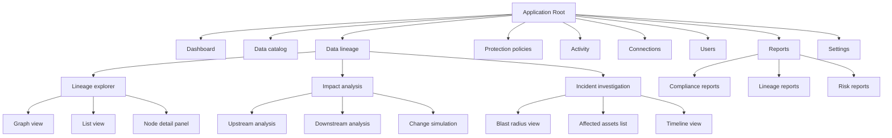

# Information Architecture: Data Lineage Visualization

## Context

This IA defines where the data lineage visualization feature fits within the existing data security product, how users navigate it, and the flows they move through. It is informed by the market research (security-aware lineage differentiator) and journey map (5 phases from awareness through optimization across 5 roles).

---

## 1. Sitemap



## 2. Navigation Structure

```
SIDEBAR (Primary Navigation)
├── Dashboard                    ← overview + risk summary
│
├── GROUP: Data Intelligence
│   ├── Data catalog             ← browse/search data assets
│   ├── Data lineage             ← NEW: lineage explorer (default)
│   └── Activity                 ← activity log
│
├── GROUP: Security
│   ├── Protection policies      ← policy management
│   ├── Connections              ← data source connections
│   └── Users                    ← access control
│
├── GROUP: Reporting
│   └── Reports                  ← compliance, lineage, risk reports
│
├── ─── spacer ───
│
└── FOOTER
    ├── Settings                 ← account settings
    └── [Collapse toggle]

PAGE TABS (within Data Lineage)
├── Explorer                     ← default: interactive graph
├── Impact analysis              ← upstream/downstream analysis
└── Incidents                    ← breach investigation

TOGGLE TABS (within Lineage Explorer)
├── Graph view                   ← DAG visualization (default)
└── List view                    ← tabular asset list

NODE DETAIL SIDE PANEL (within Graph View)
├── Overview                     ← asset name, type, owner, description
├── Columns                      ← column-level lineage + classifications
├── Security                     ← protection policies, classification status
├── Lineage                      ← upstream/downstream summary
└── History                      ← changes, scans, policy updates
```

## 3. Grouping Rationale

| Group | Rationale | User Mental Model |
|-------|-----------|-------------------|
| Data Intelligence | Core data understanding tasks — browsing assets, tracing flows, monitoring changes | "Understanding my data" |
| Security | Protection and access control — the security-specific configuration | "Protecting my data" |
| Reporting | Compliance and audit outputs — consumed periodically, not daily | "Proving my data is safe" |

### Why "Data lineage" sits under "Data Intelligence" (not Security)

The research shows three distinct personas use lineage. Placing it under "Data Intelligence" makes it accessible to all three (governance, engineering, security) rather than limiting it to the security group. The security overlay is visible within lineage, but the feature itself serves a broader audience.

### Why "Incidents" is a tab within lineage (not a separate nav item)

Incident investigation is fundamentally a lineage task — tracing data flow from a compromised asset. It uses the same graph visualization with a specialized entry point (start from the affected asset). Keeping it as a tab maintains the mental model of "lineage is where I understand data flow" while providing a purpose-built mode for security teams.

## 4. Labeling & Taxonomy

| Label | Why This Label | Alternatives Considered |
|-------|----------------|------------------------|
| Data lineage | Industry-standard term all personas recognize; matches Gartner terminology | "Data flows", "Data tracing", "Lineage explorer" |
| Explorer | Active, discovery-oriented verb; matches Atlan's successful pattern | "Graph", "Visualizer", "Browser" |
| Impact analysis | Precise description of the task; well-known term in data engineering | "Change analysis", "Dependency analysis" |
| Incidents | Concise; aligns with security team vocabulary | "Investigations", "Breach analysis", "Forensics" |
| Blast radius | Common security term for understanding scope of impact | "Affected scope", "Exposure analysis" |
| Protection policies | Existing product terminology (maintain consistency) | "Security policies", "Data policies" |

## 5. User Flows

### Flow 1: Happy Path — Explore Lineage Graph

**Persona:** Diana (Governance Lead), daily use
**Entry:** Sidebar > Data lineage > Explorer tab (default)

```
1. Land on Lineage Explorer (graph view, showing recently viewed or most-connected assets)
2. Search for a data asset by name, type, or classification
3. Graph centers on selected asset, showing 1-hop upstream and downstream
4. Click "Expand" on an upstream node to reveal its sources
5. Click a node to open the detail side panel
6. View Overview tab → see asset metadata, owner, description
7. Switch to Security tab → see classification (PII, PHI), protection status, policies applied
8. Switch to Columns tab → see column-level lineage with classification badges
9. Close side panel → return to graph exploration
10. Use minimap to navigate to a different part of the graph
```

### Flow 2: Happy Path — Impact Analysis Before Schema Change

**Persona:** Marcus (Platform Engineering Lead)
**Entry:** Sidebar > Data lineage > Impact analysis tab

```
1. Land on Impact Analysis view
2. Search for the table/column being changed
3. Select the asset → system shows all downstream consumers
4. Review downstream tree: tables, reports, dashboards affected
5. See security badges on each affected asset (PII/PHI indicators, policy status)
6. Click "Simulate change" → enter proposed change (column rename, type change, deletion)
7. System highlights affected downstream assets with severity indicators
8. Review affected-asset summary: count by type, security classification
9. Export impact report (for change request documentation)
10. Proceed with or defer the change based on analysis
```

### Flow 3: Happy Path — Incident Investigation (Breach)

**Persona:** Serena (CISO)
**Entry:** Sidebar > Data lineage > Incidents tab

```
1. Land on Incidents view (or deep-linked from SIEM alert)
2. Click "New investigation" → search for compromised data asset
3. Select asset → system generates "blast radius" visualization
4. View shows: all systems that received data from the compromised source
5. Each node shows: classification level, protection status, data volume
6. Filter by: classification (show only PII paths), time range, system type
7. Click a downstream node → see detail: when data was last received, what columns
8. Switch to "Affected assets list" → tabular view with export
9. Switch to "Timeline" → chronological view of data flow events
10. Export investigation report → PDF with blast radius diagram + affected asset inventory
```

### Flow 4: Edge Case — Empty State (No Connections Yet)

**Persona:** Diana (first-time user)
**Entry:** Sidebar > Data lineage

```
1. Land on Lineage Explorer → empty state
2. See illustration + message: "Connect your data sources to start building lineage"
3. Primary CTA: "Add connection" → navigates to Connections page
4. Secondary CTA: "Learn more" → opens documentation
5. After connecting first source, return to lineage → see "Scanning..." progress
6. When scan completes, graph populates with discovered assets
7. Banner: "12 data assets discovered. 3 have existing security classifications."
```

### Flow 5: Edge Case — Large Graph (10,000+ Assets)

**Persona:** Marcus (large enterprise)
**Entry:** Lineage Explorer with full data estate loaded

```
1. Land on Explorer → graph shows clustered overview (systems as groups)
2. See "12,847 assets across 6 systems" summary bar
3. Default view: system-level nodes (Snowflake, dbt, Airflow, S3, Redshift, Tableau)
4. Click a system node → expands to show databases/schemas
5. Click a schema → expands to show tables
6. Click a table → expands to show columns
7. Use search to jump directly to a specific asset (bypassing drill-down)
8. Use filters: classification level, protection status, system type, owner
9. Minimap shows position in overall graph
10. "Focus mode" → isolates selected asset + N hops, hides everything else
```

### Flow 6: Fringe Case — Concurrent Lineage Scan During Investigation

**Persona:** Serena (during active incident while a lineage scan is running)

```
1. Open Incidents tab → start investigation on compromised asset
2. Notice banner: "Lineage scan in progress — results may be incomplete"
3. Blast radius shows known paths with "confidence: high" indicators
4. Some paths show "confidence: low — scan pending" with dashed edges
5. As scan progresses, new paths appear with a subtle animation
6. Notification when scan completes: "Scan complete — 3 new paths discovered"
7. Blast radius updates automatically with new paths highlighted
```

### Flow 7: Error State — Failed Lineage Scan

**Persona:** Marcus (connection issue)

```
1. Navigate to Lineage Explorer
2. See stale data indicator: "Last scan: 3 days ago (scan failed)"
3. Click "View error" → see error detail: "Connection to Snowflake timed out"
4. Suggested actions: "Check connection settings" (link) or "Retry scan" (button)
5. Click "Retry scan" → scan begins, progress indicator shown
6. If retry succeeds → lineage refreshes with new data
7. If retry fails again → error persists with "Contact support" fallback
```

### Flow 8: Error State — Missing Lineage for Protected Asset

**Persona:** Diana (compliance gap)

```
1. Browse Data Catalog → find a PII-classified asset
2. Click to view lineage → "No lineage available for this asset"
3. See warning: "This asset is classified as PII but has no lineage data"
4. This is flagged as a compliance risk in the dashboard risk widget
5. Suggested action: "Add lineage manually" or "Connect source system"
6. If connected source doesn't support automated lineage → manual lineage editor
7. Manual lineage: drag-and-drop to create upstream/downstream relationships
```

## 6. Scalability Considerations

| Concern | Approach |
|---------|----------|
| More data sources over time | Connections page already supports growth; lineage graph handles additional systems as clustered groups |
| New compliance frameworks | Reports section can accommodate new report types via tabs |
| Additional user roles | Navigation groups are role-agnostic; per-role views handled via dashboard widgets and filtered views |
| Sidebar item growth | Current count: 8 items + 2 footer items = within 10-item recommendation. Room for 2-3 more items before needing redesign |
| Tab growth on lineage page | 3 tabs currently (Explorer, Impact analysis, Incidents). Could add "Analytics" tab later. Max 6 recommended |
